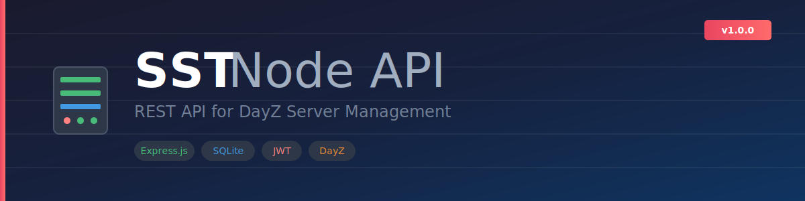

# SST Node API

<p align="center">
  
</p>

<p align="center">
  <strong>REST API for DayZ server management - bridges your web dashboard with DayZ server files</strong>
</p>

<p align="center">
  
  
  
</p>

> ⚠️ **NON-COMMERCIAL LICENSE** - Free for personal and community use. Commercial use is **strictly prohibited** and will result in DMCA action. See [LICENSE](LICENSE).

## Features

- 🎮 **Player Management** - View online players, inventory, commands
- 🚗 **Vehicle Tracking** - Track, locate, and manage vehicles
- 🎁 **Item Granting** - Grant items to players in-game
- 📊 **Economy Analysis** - Parse types.xml and market data
- 🗺️ **Position Tracking** - Historical player position data
- 🏪 **Expansion Integration** - Full market and trader editing
- 📜 **Log Viewing** - Real-time server log access
- 🔐 **Authentication** - JWT + API key dual auth system

## Quick Start

```bash
# Clone the repository
git clone https://github.com/yourusername/sst-node-api.git
cd sst-node-api

# Install dependencies
npm install

# Configure environment
cp .env.example .env
# Edit .env with your paths (see Configuration below)

# Start the server
npm start
```

API runs at `http://localhost:3001`

## Configuration

Edit `.env` with your DayZ server paths:

```env
# Server
PORT=3001
HOST=0.0.0.0

# DayZ Paths (REQUIRED)
DAYZ_SERVER_PATH=C:/DayZServer
DAYZ_PROFILE_PATH=C:/DayZServer/profiles
SST_PATH=C:/DayZServer/profiles/SST

# Security (REQUIRED for production)
JWT_SECRET=your-secure-random-secret
API_KEY=your-api-key
```

## Documentation

| Document | Description |
|----------|-------------|
| [Setup Guide](docs/SETUP.md) | Full installation walkthrough |
| [API Reference](docs/API.md) | Complete endpoint documentation |
| [Architecture](docs/ARCHITECTURE.md) | Technical design overview |
| [Contributing](CONTRIBUTING.md) | How to contribute |
| [Changelog](CHANGELOG.md) | Version history |

## Project Structure

```
sst-node-api/
├── src/
│   ├── server.js        # Express entry point
│   ├── config.js        # Path configuration
│   ├── auth/            # Authentication system
│   ├── db/              # SQLite databases
│   ├── routes/          # API endpoints
│   ├── middleware/      # Express middleware
│   └── utils/           # Utilities
├── data/                # Database files
├── docs/                # Documentation
└── .env                 # Configuration
```

## API Overview

```bash
# Health check
GET /api/health

# Player data
GET /api/dashboard
GET /api/online
GET /api/online/:playerId

# Items
GET /api/items/search?query=M4
POST /api/grants

# Vehicles
GET /api/vehicles
POST /api/vehicles/:id/generate-key

# Commands
POST /api/commands/heal
POST /api/commands/teleport

# Authentication
POST /api/auth/login
```

See [API Reference](docs/API.md) for complete documentation.

## Related Projects

- **[SST Dashboard](../sst-dashboard)** - React web dashboard
- **SST DayZ Mod** - EnforceScript mod (required)

## Support

- 📖 [Documentation](docs/)
- 🐛 [Report a Bug](.github/ISSUE_TEMPLATE/bug_report.md)
- 💡 [Request a Feature](.github/ISSUE_TEMPLATE/feature_request.md)

## License

This project is licensed under a **Non-Commercial License**.

- ✅ Free for personal use
- ✅ Free for community servers
- ❌ **No commercial use**
- ❌ **No selling or monetization**

Violations will result in DMCA takedowns. See [LICENSE](LICENSE) for full terms.

---

Made with ❤️ by the SST Development Team
